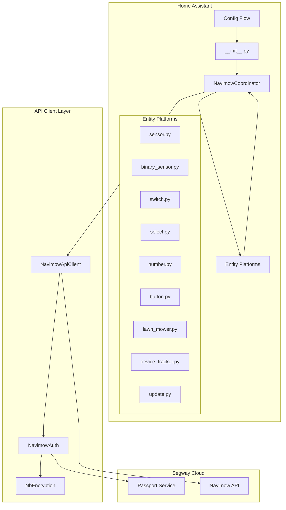
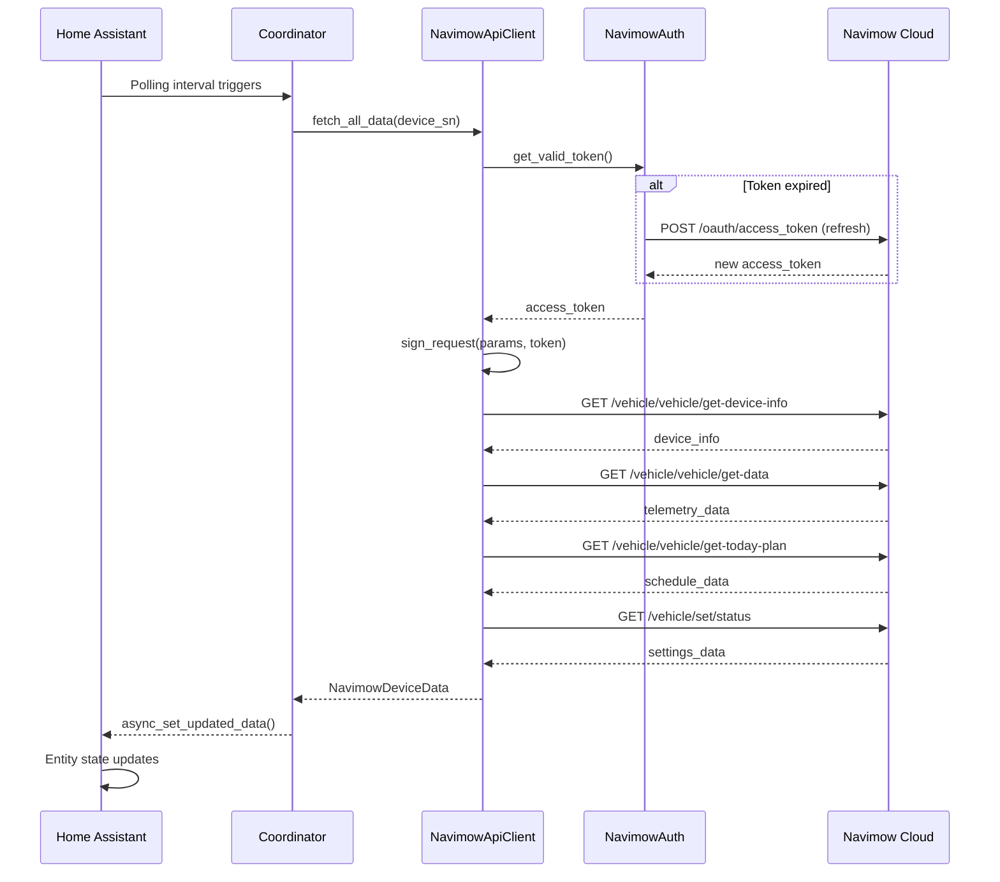
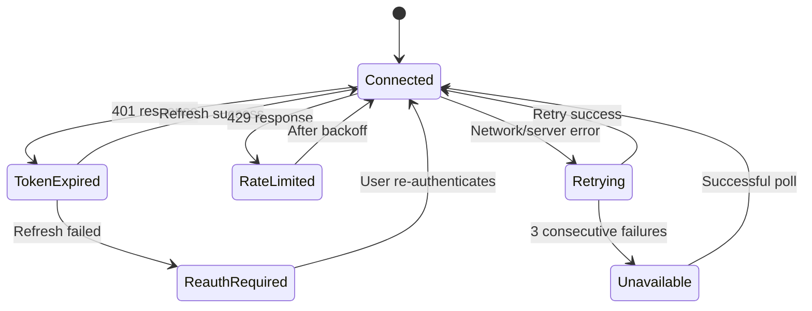

# Design Document: Navimow Home Assistant Integration

## Overview

This document describes the technical design for a HACS-compatible Home Assistant custom integration for the Segway Navimow i105/i108 robotic lawn mower. The integration communicates with the Segway/Ninebot cloud platform via regional REST APIs and exposes device state, sensors, controls, configuration, maps, schedules, and error notifications as Home Assistant entities.

### Design Goals

- **Cloud-polling architecture** using Home Assistant's `DataUpdateCoordinator` pattern with adaptive polling intervals based on mower state
- **Full entity coverage** across 9 entity platforms: sensor, binary_sensor, switch, select, number, button, lawn_mower, device_tracker, update
- **Robust authentication** with automatic token refresh, re-authentication flows, and regional endpoint routing
- **HACS-compatible** file structure following Home Assistant integration quality standards
- **Resilient error handling** with exponential backoff, graceful degradation, and user-facing notifications

### Key Design Decisions

| Decision | Rationale |
|----------|-----------|
| Cloud polling over MQTT | MQTT requires persistent connections and complex NINEIOT protocol handling; cloud polling is simpler, more reliable for a first release, and sufficient for most use cases |
| Single coordinator per device | Each mower has independent state; separate coordinators allow per-device adaptive polling |
| Separate API client library | Decouples HTTP/auth logic from HA-specific code; enables unit testing and potential reuse |
| NbEncryption via pure Python | Avoids native library dependency; the encryption is a standard HMAC-based request signing |

## Architecture

### Component Diagram



### Data Flow



## Components and Interfaces

### 1. NavimowApiClient

The API client handles all HTTP communication with the Navimow cloud platform.

```python
class NavimowApiClient:
    """Client for the Navimow cloud API."""
    
    def __init__(
        self,
        session: aiohttp.ClientSession,
        auth: NavimowAuth,
        region: str,
    ) -> None: ...
    
    @property
    def base_url(self) -> str:
        """Return regional API base URL."""
        # https://navimow-{region}.ninebot.com/
    
    async def get_devices(self) -> list[NavimowDevice]: ...
    async def get_device_info(self, device_sn: str) -> DeviceInfo: ...
    async def get_device_data(self, device_sn: str) -> DeviceTelemetry: ...
    async def get_today_plan(self, device_sn: str) -> ScheduleData: ...
    async def get_settings_status(self, device_sn: str) -> SettingsData: ...
    async def get_location(self, device_sn: str) -> LocationData: ...
    async def get_trail_list(self, device_sn: str) -> list[TrailEntry]: ...
    async def get_trail_detail(self, trail_id: str) -> TrailDetail: ...
    async def get_errors(self, device_sn: str) -> list[ErrorInfo]: ...
    async def get_firmware_info(self, device_sn: str) -> FirmwareInfo: ...
    async def get_bms_detail(self, device_sn: str) -> BmsDetail: ...
    
    # Commands
    async def send_command(self, device_sn: str, command: str, params: dict | None = None) -> bool: ...
    async def set_setting(self, device_sn: str, key: str, value: Any) -> bool: ...
    async def set_power(self, device_sn: str, action: str) -> bool: ...
```

### 2. NavimowAuth

Handles OAuth token lifecycle and request signing.

```python
class NavimowAuth:
    """Authentication handler for Navimow API."""
    
    def __init__(
        self,
        session: aiohttp.ClientSession,
        region: str,
        access_token: str,
        refresh_token: str,
        token_expiry: datetime,
        on_token_refresh: Callable[[str, str, datetime], Awaitable[None]],
    ) -> None: ...
    
    @property
    def passport_url(self) -> str:
        """Return regional passport URL."""
        # https://api-passport-{region}.ninebot.com/
    
    async def async_get_access_token(self) -> str:
        """Return valid access token, refreshing if needed."""
    
    async def async_refresh_token(self) -> tuple[str, str, datetime]:
        """Refresh the access token using refresh_token."""
    
    def sign_request(self, params: dict[str, str]) -> dict[str, str]:
        """Sign request parameters with NbEncryption."""
    
    @staticmethod
    async def async_login(
        session: aiohttp.ClientSession,
        region: str,
        username: str,
        password: str,
    ) -> tuple[str, str, datetime]:
        """Perform initial login, return tokens."""
```

### 3. NbEncryption

Pure Python implementation of the Ninebot request signing protocol.

```python
class NbEncryption:
    """Ninebot API request signing."""
    
    APP_FROM = "navimow"
    APP_BRAND = "Android"
    
    @staticmethod
    def sign_params(
        params: dict[str, str],
        access_token: str,
        timestamp: int,
        nonce: str,
    ) -> str:
        """Generate HMAC signature for API request parameters."""
    
    @staticmethod
    def generate_nonce() -> str:
        """Generate random nonce for request signing."""
    
    @staticmethod
    def build_signed_headers(
        access_token: str,
        signature: str,
        timestamp: int,
        nonce: str,
    ) -> dict[str, str]:
        """Build HTTP headers with authentication and signature."""
```

### 4. NavimowCoordinator

Extends Home Assistant's `DataUpdateCoordinator` with adaptive polling.

```python
class NavimowCoordinator(DataUpdateCoordinator[NavimowDeviceData]):
    """Coordinator for a single Navimow device."""
    
    POLL_INTERVAL_ACTIVE = timedelta(seconds=10)
    POLL_INTERVAL_DEFAULT = timedelta(seconds=30)
    POLL_INTERVAL_IDLE = timedelta(seconds=60)
    
    def __init__(
        self,
        hass: HomeAssistant,
        config_entry: ConfigEntry,
        api_client: NavimowApiClient,
        device_sn: str,
    ) -> None: ...
    
    async def _async_setup(self) -> None:
        """Load initial device info (called once)."""
    
    async def _async_update_data(self) -> NavimowDeviceData:
        """Fetch all device data in a batched update cycle."""
    
    def _adjust_polling_interval(self, state: MowerState) -> None:
        """Adjust update_interval based on mower activity state."""
    
    @property
    def device_info(self) -> DeviceInfo:
        """Return HA device registry info."""
```

### 5. Entity Base Class

```python
class NavimowEntity(CoordinatorEntity[NavimowCoordinator]):
    """Base entity for Navimow integration."""
    
    _attr_has_entity_name = True
    
    def __init__(
        self,
        coordinator: NavimowCoordinator,
        description: EntityDescription,
    ) -> None: ...
    
    @property
    def device_info(self) -> DeviceInfo:
        """Return device info from coordinator."""
```

### 6. Config Flow

```python
class NavimowConfigFlow(ConfigFlow, domain=DOMAIN):
    """Config flow for Navimow integration."""
    
    VERSION = 1
    
    async def async_step_user(self, user_input=None) -> ConfigFlowResult:
        """Handle user-initiated setup (credentials + region)."""
    
    async def async_step_devices(self, user_input=None) -> ConfigFlowResult:
        """Handle device selection after successful auth."""
    
    async def async_step_reauth(self, entry_data) -> ConfigFlowResult:
        """Handle re-authentication when tokens expire."""
    
    async def async_step_reauth_confirm(self, user_input=None) -> ConfigFlowResult:
        """Handle re-authentication confirmation."""
```

## Data Models

### Core Data Classes

```python
from dataclasses import dataclass, field
from datetime import datetime
from enum import StrEnum

class MowerState(StrEnum):
    """Mower operational states."""
    MOWING = "mowing"
    RETURNING = "returning"
    CHARGING = "charging"
    STANDBY = "standby"
    PAUSED = "paused"
    ERROR = "error"
    MAPPING = "mapping"
    CALIBRATING = "calibrating"
    IDLE_PARKING = "idle_parking"

class WorkMode(StrEnum):
    """Mowing work modes."""
    STANDARD = "standard"
    FAST = "fast"
    SILENT = "silent"

class TaskState(StrEnum):
    """Current task states."""
    SCHEDULED_MOWING = "scheduled_mowing"
    MANUAL_MOWING = "manual_mowing"
    NO_TASK = "no_task"
    WAITING = "waiting"
    CANCELLED = "cancelled"
    COMPLETED = "completed"

@dataclass
class NavimowDevice:
    """Discovered device from account."""
    device_sn: str
    name: str
    model: str
    online: bool

@dataclass
class DeviceInfo:
    """Static device information."""
    device_sn: str
    model: str
    name: str
    firmware_versions: FirmwareVersions
    manufacturer: str = "Segway"

@dataclass
class FirmwareVersions:
    """All firmware component versions."""
    ecu: str
    bms: str
    gps: str
    bluetooth: str
    wifi: str
    blade_motor: str  # NCU
    charging_station: str  # CGS
    iot: str  # Telematics BOX
    audio: str  # MSC
    bump_sensor: str
    vision_fence: str | None = None

@dataclass
class DeviceTelemetry:
    """Real-time telemetry data."""
    battery_level: int  # 0-100
    battery_voltage: float
    battery_temperature_fault: bool
    state: MowerState
    work_mode: WorkMode
    task_state: TaskState
    mowing_progress: int  # 0-100
    current_mowing_area: float  # m²
    total_mowing_area: float  # m²
    blade_usage_time: float  # hours
    blade_lifetime_hours: float  # manufacturer recommended replacement interval (default 200)
    total_mowing_time: float  # hours
    network_type: str
    cellular_signal: int  # CSQ
    mqtt_connected: bool
    wifi_ssid: str | None

@dataclass
class MaintenanceData:
    """Maintenance and blade management data."""
    blade_usage_hours: float  # cumulative blade operating hours
    blade_lifetime_hours: float  # recommended replacement interval (default 200h)
    blade_remaining_life_pct: float  # calculated: max(0, (1 - usage/lifetime) * 100)
    blade_replacement_needed: bool  # True if remaining life < 10% or hint received
    maintenance_status: str  # ok, blade_replacement_due, cleaning_needed, service_required
    maintenance_hints: list[MaintenanceHint]  # active maintenance hints from API

@dataclass
class MaintenanceHint:
    """A single maintenance hint from the device."""
    hint_type: str  # blade_wear, cleaning, service
    title: str
    description: str
    timestamp: datetime

@dataclass
class LocationData:
    """GPS location data."""
    latitude: float
    longitude: float
    altitude: float
    speed: float
    hdop: float
    satellites_in_use: int
    satellites_in_view: int
    data_valid: bool

@dataclass
class ScheduleData:
    """Today's mowing schedule."""
    schedule_enabled: bool
    next_start: datetime | None
    next_end: datetime | None
    schedules: list[ScheduleEntry] = field(default_factory=list)

@dataclass
class ScheduleEntry:
    """Single schedule entry."""
    start_time: datetime
    end_time: datetime
    zones: list[str]
    active: bool

@dataclass
class SettingsData:
    """Device settings."""
    cutting_height: int  # mm
    work_mode: WorkMode
    rain_sensor: bool
    edge_mowing: bool
    mowing_cycle: bool
    anti_theft: bool
    dark_mode: bool
    anti_interference: bool | None  # None if not supported
    plan_switch: bool

@dataclass
class MapData:
    """Map and zone information."""
    boundaries: list[list[tuple[float, float]]]
    islands: list[list[tuple[float, float]]]
    channels: list[list[tuple[float, float]]]
    zones: list[ZoneInfo]
    map_status: str  # valid, needs_update, no_map
    total_area: float  # m²

@dataclass
class ZoneInfo:
    """Individual mowing zone."""
    zone_id: str
    name: str
    area: float
    active: bool

@dataclass
class ErrorInfo:
    """Active error information."""
    code: int
    title: str
    content: str
    severity: int  # 1-3
    timestamp: datetime

@dataclass
class TrailEntry:
    """Mowing trail history entry."""
    trail_id: str
    date: datetime
    duration: float  # minutes
    area: float  # m²

@dataclass
class FirmwareInfo:
    """Available firmware update info."""
    update_available: bool
    new_version: str | None
    release_notes: str | None
    current_versions: FirmwareVersions

@dataclass
class BmsDetail:
    """Battery management system details."""
    voltage: float
    current: float
    temperature: float
    cycles: int
    health: int  # percentage

@dataclass
class NavimowDeviceData:
    """Complete device data returned by coordinator."""
    device_info: DeviceInfo
    telemetry: DeviceTelemetry
    location: LocationData
    schedule: ScheduleData
    settings: SettingsData
    map_data: MapData | None
    errors: list[ErrorInfo]
    trail_history: list[TrailEntry]
    firmware: FirmwareInfo
    bms: BmsDetail
    maintenance: MaintenanceData
```

### State Mapping

The API returns numeric state codes that map to `MowerState`:

| API State Code | MowerState | Description |
|---|---|---|
| `WORK_MOWING` | `mowing` | Actively mowing |
| `WORK_RETURNING` | `returning` | Returning to dock |
| `IDLE_CHARGING` | `charging` | Docked and charging |
| `IDLE_STANDBY` | `standby` | Docked, fully charged |
| `IDLE_PARKING` | `idle_parking` | Parked outside dock |
| `WORK_PAUSED` | `paused` | Paused mid-task |
| `ERROR_*` | `error` | Any error state |
| `WORK_MAPPING` | `mapping` | Creating/updating map |
| `WORK_CALIBRATING` | `calibrating` | RTK calibration |

### LawnMower Activity Mapping

| MowerState | LawnMowerActivity |
|---|---|
| `mowing`, `mapping`, `calibrating` | `MOWING` |
| `charging`, `standby` | `DOCKED` |
| `paused` | `PAUSED` |
| `returning` | `RETURNING` |
| `error` | `ERROR` |
| `idle_parking` | `DOCKED` |


## Correctness Properties

*A property is a characteristic or behavior that should hold true across all valid executions of a system — essentially, a formal statement about what the system should do. Properties serve as the bridge between human-readable specifications and machine-verifiable correctness guarantees.*

### Property 1: Regional URL Construction

*For any* valid region code in the set {`fra`, `ore`, `sg`, `bj`, `mos`}, the constructed API base URL SHALL equal `https://navimow-{region}.ninebot.com/` and the passport URL SHALL equal `https://api-passport-{region}.ninebot.com/`.

**Validates: Requirements 1.5**

### Property 2: Request Signing Determinism

*For any* valid set of request parameters, access token, timestamp, and nonce, calling `sign_params` twice with identical inputs SHALL produce identical signature output. Additionally, the signed headers SHALL always contain the `appfrom=navimow` and `appbrand=Android` identifiers.

**Validates: Requirements 1.6**

### Property 3: Token Refresh on Expiry

*For any* API request made when the current access token's expiry time is in the past, the auth layer SHALL attempt a token refresh before executing the request, and the request SHALL be sent with the new token (not the expired one).

**Validates: Requirements 1.3, 17.1**

### Property 4: State-to-Polling-Interval Mapping

*For any* `MowerState` value, the coordinator's polling interval SHALL be: 10 seconds if the state is in {`mowing`, `returning`, `mapping`, `calibrating`}; 60 seconds if the state is in {`charging`, `standby`, `idle_parking`}; and 30 seconds for all other states (`paused`, `error`).

**Validates: Requirements 3.2, 3.3**

### Property 5: Exponential Backoff Calculation

*For any* number of consecutive failures N (where N ≥ 1), the retry delay SHALL equal `min(30 × 2^(N-1), 300)` seconds. The delay SHALL never exceed 300 seconds and SHALL never be less than 30 seconds.

**Validates: Requirements 3.5**

### Property 6: API State Code to MowerState Mapping

*For any* valid API state code returned by the device, the state mapping function SHALL produce exactly one corresponding `MowerState` enum value, and the mapping SHALL be total (no valid state code maps to an undefined value).

**Validates: Requirements 5.1**

### Property 7: MowerState to LawnMowerActivity Mapping

*For any* `MowerState` value, the activity mapping function SHALL produce exactly one valid `LawnMowerActivity` value from {`MOWING`, `DOCKED`, `PAUSED`, `RETURNING`, `ERROR`}, and the mapping SHALL be total over all `MowerState` variants.

**Validates: Requirements 9.1**

### Property 8: GPS Validity to Device Tracker State

*For any* `LocationData` instance, if `data_valid` is `False` then the device tracker state SHALL be `unknown`; if `data_valid` is `True` then the device tracker state SHALL be `home` or `not_home` with valid latitude and longitude values.

**Validates: Requirements 6.7**

### Property 9: Error Code to Message Mapping

*For any* valid error code in the known error code range (vehicle errors 1–69, map errors 1–9), the error message lookup function SHALL return a non-empty string. For error code 0, the function SHALL return an empty string or "No error".

**Validates: Requirements 14.2**

### Property 10: Rate Limit Backoff Duration

*For any* HTTP 429 response, if a `Retry-After` header is present with a positive integer value, the backoff duration SHALL equal that value in seconds. If the header is absent or unparseable, the backoff duration SHALL default to 60 seconds. The backoff duration SHALL never be negative.

**Validates: Requirements 17.4**

### Property 11: Credential Redaction in Logs

*For any* log message produced by the integration at any log level, the message content SHALL NOT contain the literal value of the access token, refresh token, or user password. Token values SHALL be redacted or omitted entirely.

**Validates: Requirements 21.3**

### Property 12: Blade Remaining Life Calculation

*For any* blade usage time U ≥ 0 and blade lifetime L > 0, the blade remaining life percentage SHALL equal `max(0, (1 - U/L) * 100)`. The result SHALL always be in the range [0, 100]. The `blade_replacement_needed` flag SHALL be `True` if and only if the remaining life is below 10%.

**Validates: Requirements 20.2, 20.3**

**Validates: Requirements 20.3**

## Error Handling

### Error Categories and Responses

| Error Type | HTTP Code | Response | Recovery |
|---|---|---|---|
| Authentication expired | 401 | Refresh token, retry request | Automatic |
| Refresh token invalid | 401 (on refresh) | Trigger reauth flow | User action required |
| Rate limited | 429 | Back off per Retry-After header | Automatic |
| Network timeout | — | Retry with exponential backoff | Automatic |
| Server error | 500/502/503 | Retry with exponential backoff | Automatic |
| Device offline | 200 (empty data) | Mark device unavailable | Automatic on next success |
| Invalid command state | 200 (error response) | Raise HomeAssistantError | User notification |
| SSL certificate error | — | Reject connection, log error | User action required |

### Retry Strategy

```python
class RetryConfig:
    """Retry configuration for API requests."""
    initial_delay: float = 30.0  # seconds
    max_delay: float = 300.0  # seconds (5 minutes)
    backoff_factor: float = 2.0
    max_retries: int = 3  # before marking unavailable
    
    def get_delay(self, attempt: int) -> float:
        """Calculate delay for attempt N (1-indexed)."""
        return min(self.initial_delay * (self.backoff_factor ** (attempt - 1)), self.max_delay)
```

### Error State Machine



### Token Refresh Flow

1. API request returns 401 Unauthorized
2. Auth layer attempts token refresh using `refresh_token`
3. If refresh succeeds: store new tokens, retry original request
4. If refresh fails (401 on refresh endpoint): 
   - Mark config entry as needing reauth
   - Create persistent notification for user
   - All entities become unavailable until user re-authenticates

### Command Error Handling

When a mower command (start, pause, dock) fails:
- **Incompatible state**: Raise `HomeAssistantError` with descriptive message (e.g., "Cannot dock: mower is already docked")
- **Network failure**: Raise `HomeAssistantError` with "Communication error" message
- **API rejection**: Raise `HomeAssistantError` with the API error message

### Setting Change Rollback

When a setting change fails:
1. Send setting update via `vehicle/set/set`
2. If API returns error: revert entity state to previous value, log warning
3. If API returns success: trigger coordinator refresh to confirm new value
4. If confirmation shows old value: log warning (possible firmware delay, do not revert)

## Testing Strategy

### Testing Framework

- **Unit tests**: `pytest` with `pytest-asyncio` for async code
- **Property-based tests**: `hypothesis` library for Python
- **Mocking**: `aiohttp` test utilities and `unittest.mock` for API mocking
- **Home Assistant test utilities**: `pytest-homeassistant-custom-component` for integration testing

### Property-Based Tests

Each correctness property maps to a single property-based test with minimum 100 iterations:

| Property | Test Module | Generator Strategy |
|---|---|---|
| P1: Regional URL | `test_api_client.py` | `st.sampled_from(["fra", "ore", "sg", "bj", "mos"])` |
| P2: Request signing | `test_encryption.py` | `st.dictionaries(st.text(), st.text())` for params, `st.text()` for token |
| P3: Token refresh | `test_auth.py` | `st.datetimes()` for expiry times relative to now |
| P4: Polling interval | `test_coordinator.py` | `st.sampled_from(MowerState)` |
| P5: Backoff calc | `test_coordinator.py` | `st.integers(min_value=1, max_value=20)` for attempt count |
| P6: State mapping | `test_models.py` | `st.sampled_from(API_STATE_CODES)` |
| P7: Activity mapping | `test_models.py` | `st.sampled_from(MowerState)` |
| P8: GPS validity | `test_device_tracker.py` | `st.builds(LocationData, ...)` with `st.booleans()` for data_valid |
| P9: Error messages | `test_errors.py` | `st.integers(min_value=0, max_value=69)` for error codes |
| P10: Rate limit | `test_api_client.py` | `st.integers(min_value=1, max_value=3600)` for retry-after values |
| P11: Log redaction | `test_security.py` | `st.text(min_size=10)` for token values, various error scenarios |
| P12: Blade life calc | `test_maintenance.py` | `st.floats(min_value=0, max_value=1000)` for usage, `st.floats(min_value=1, max_value=500)` for lifetime |

Each test is tagged with: `# Feature: navimow-home-assistant, Property {N}: {title}`

### Unit Tests (Example-Based)

Focus areas for unit tests:
- Config flow happy path and error paths
- Entity creation and attribute mapping
- Command execution (mocked API)
- Event firing on state transitions
- Device registry setup
- Setting change with rollback on failure

### Integration Tests

- Full coordinator update cycle with mocked API responses
- Token refresh during active polling
- Device discovery and dynamic addition
- Reauth flow trigger and completion
- HACS manifest validation

### Test File Structure

```
tests/
├── conftest.py              # Shared fixtures (mock API, coordinator, etc.)
├── test_api_client.py       # API client unit + property tests
├── test_auth.py             # Authentication and token management
├── test_encryption.py       # NbEncryption signing tests
├── test_config_flow.py      # Config flow tests
├── test_coordinator.py      # Coordinator polling and backoff tests
├── test_models.py           # Data model mapping tests
├── test_sensor.py           # Sensor entity tests
├── test_binary_sensor.py    # Binary sensor tests
├── test_switch.py           # Switch entity tests
├── test_select.py           # Select entity tests
├── test_number.py           # Number entity tests
├── test_button.py           # Button entity tests
├── test_lawn_mower.py       # Lawn mower entity tests
├── test_device_tracker.py   # Device tracker tests
├── test_update.py           # Update entity tests
├── test_errors.py           # Error handling and event tests
├── test_maintenance.py      # Maintenance and blade life tests
└── test_security.py         # Security property tests
```

## HACS-Compatible File Structure

```
custom_components/
└── navimow/
    ├── __init__.py           # Integration setup, platform forwarding
    ├── config_flow.py        # UI-based setup wizard
    ├── const.py              # Constants, domains, defaults
    ├── coordinator.py        # NavimowCoordinator (adaptive polling)
    ├── entity.py             # NavimowEntity base class
    ├── models.py             # Data classes and enums
    ├── api_client.py         # NavimowApiClient (HTTP layer)
    ├── auth.py               # NavimowAuth (OAuth + token management)
    ├── encryption.py         # NbEncryption (request signing)
    ├── errors.py             # Error code mapping and custom exceptions
    ├── sensor.py             # Sensor platform
    ├── binary_sensor.py      # Binary sensor platform
    ├── switch.py             # Switch platform
    ├── select.py             # Select platform
    ├── number.py             # Number platform
    ├── button.py             # Button platform
    ├── lawn_mower.py         # Lawn mower platform
    ├── device_tracker.py     # Device tracker platform
    ├── update.py             # Update platform
    ├── manifest.json         # HA integration manifest
    ├── strings.json          # Default strings
    └── translations/
        └── en.json           # English translations
├── hacs.json                 # HACS manifest
└── README.md                 # Documentation
```

### manifest.json

```json
{
  "domain": "navimow",
  "name": "Segway Navimow",
  "codeowners": ["@navimow-ha"],
  "config_flow": true,
  "documentation": "https://github.com/navimow-ha/navimow-home-assistant",
  "iot_class": "cloud_polling",
  "issue_tracker": "https://github.com/navimow-ha/navimow-home-assistant/issues",
  "requirements": ["aiohttp>=3.8.0"],
  "version": "1.0.0",
  "homeassistant": "2024.1.0"
}
```

### hacs.json

```json
{
  "name": "Segway Navimow",
  "homeassistant": "2024.1.0",
  "render_readme": true
}
```
